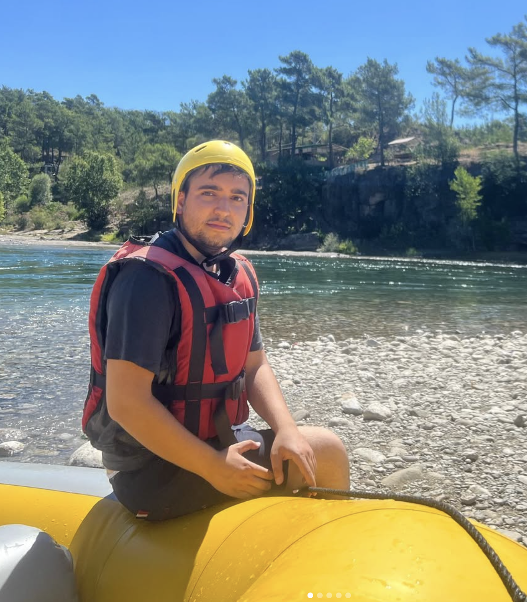
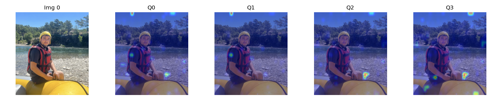
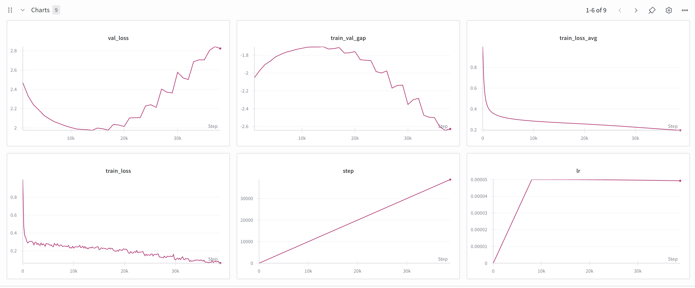

# BLIPren

A toy project, basically plug and train any llm to be a "VLM :D". Almost identical to the [BLIP-2 architecture](https://arxiv.org/abs/2301.12597). Qformer and projector must adapt to the LLM you are using. You can run any of the training notebooks on colab using L4 and above, and it should just work.

## Architecture

Based on [BLIP-2: Bootstrapping Language-Image Pre-training with Frozen Image Encoders and Large Language Models](https://arxiv.org/abs/2301.12597) by Li et al. (2023). The implementation uses:

- Frozen SigLIP vision encoder
- Q-Former with self-attention + cross-attention blocks
- Projector (either simple MLP or MoE-based)
- Frozen LLM (tested with Llama-3.2-1B)

## Variants

**Normal version**: Simple projector with residual connections - works well with batch_size=32

**MoE version**: Image-level routing with 4 experts - requires more tuning and larger batches. After I wrote that one I couldn't really test it with bigger batches as I couldn't get any A100s.

## Data

Uses [LAION&#39;s 220k-GPT4Vision-captions-from-LIVIS dataset](https://huggingface.co/datasets/laion/220k-GPT4Vision-captions-from-LIVIS). Training on ~50k-100k samples with prefixed captions ("Short caption: ...").

I also didn't spend too much time on finding a ds, i first used a set of anime images, then flickr8k, both was not enough, finally with this LIVIS it was okayish.

## Experiments

Also tried adapting [Baguettotron](https://huggingface.co/PleIAs/Baguettotron) with its reasoning trace style outputs, but it took way too long to adapt to the reasoning format.

## Results

Results are from the 10k step checkpoint (normal training version) - the model started to overfit afterwards.

### Example Generation

**Generated Caption:**

> "A person in a yellow life jacket sits on a yellow boat near a rocky shoreline, surrounded by trees and a clear sky, indicating a recreational activity or training session. The person wears a helmet and holds a yellow paddle, while the boat is stationary. The sky is clear, and the person's face is visible, indicating"

### Attention Visualizations

**Target Image:**

**Q-Former Attention Patterns:**

### Training Progress (40k steps)

The model shows good convergence on the training set. Validation loss plateaus around 10k steps, with some overfitting observed beyond that point.

## Notes

The data processing is extremely inefficient and batch size is only to increase the effective batchsize basically, the pipeline is extremely bottlenecked from other parts of the code. As this architecture is pretty old I thought it is not worth optimizing it. Ideally, embedding all images and tokenizing all captions in advance then keeping in an arrow file should be the way.

MoE weights are not good, not worth sharing, normal weights are a bit better but not gonna change anyone life so idk if I should upload it to somewhere, if you need, lmk.

## TODOs

- [ ] **Fix data pipeline**: Pre-embed images and tokenize captions, store in Arrow format for efficient loading
- [ ] **Optimize training**: Better batch processing, remove bottlenecks
- [ ] **Improve data quality**: Better caption filtering, more diverse dataset
- [ ] **Code refactoring**: Move from notebooks to proper Python modules
- [ ] **Remove code duplication**: Create shared utilities for training/inference
- [ ] **Restructure project**: Organize into proper directories (src/, data/, models/, etc.)
- [ ] **MoE improvements**: Add load balancing loss, test with larger batch sizes
